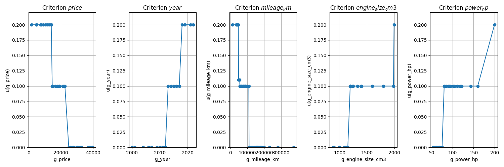

# Multi-Criteria Decision Analysis Report

## Authors
- Mateusz Stawicki 155900
- Mateusz Idziejczak 155842

## Car Selection Problem Analysis

### 1. Dataset Description

We analyzed a set of 10 small city cars available for sale within 100 km of Koziegłowy, with prices under 40,000 PLN. The data comes from [OTOMOTO](https://www.otomoto.pl/), where we scraped listings for cars that might suit a PUT student's needs. We narrowed down from 50 initial listings to 10 representative options to keep our analysis manageable.

Our *totally fictional* buyer is a student living in Koziegłowy, Wielkopolskie - who needs a reliable city car that balances cost, age, mileage, and performance. Since they're a student, practical considerations outweigh aesthetics or comfort - they want the best value for money and maybe a bit of engine power to impress friends.

Specifically, the dataset comprises the first 50 listings from [this exact url](https://www.otomoto.pl/osobowe/seg-mini/kozieglowy_8905?search%5Bdist%5D=100&search%5Bfilter_enum_fuel_type%5D=petrol&search%5Bfilter_float_price%3Ato%5D=40000&search%5Badvanced_search_expanded%5D=true)

Not all available scraped data was used for the MCDA in the end. Still, it is present in the dataset for reference.

#### Full dataset
|title|subtitle|price|currency|year|mileage_km|fuel_type|gearbox|location|seller_type|price_evaluation|url|engine_size_cm3|power_hp|
|---|---|---|---|---|---|---|---|---|---|---|---|---|---|
|Renault Clio 0.9 Energy TCe Limited|898 cm3 - 90 KM - Salon Polska, Pierwszy właściciel, bezwypadkowy i bezkolizyjny|39500|PLN|2017|60098|Benzyna|Manualna|Rawicz (Wielkopolskie)|Prywatny sprzedawca|Powyżej średniej|https://www.otomoto.pl/osobowe/oferta/renault-clio-salon-polska-pierwszy-wlasciciel-bezwypadkowy-i-bezkolizyjny-ID6Hhjbk.html|898|90|
|Dacia Sandero Stepway TCe 90 (S&S) Essential|898 cm3 - 90 KM|39360|PLN|2019|65900|Benzyna|Manualna|Dobrcz (Kujawsko-pomorskie)|Prywatny sprzedawca|W granicach średniej|https://www.otomoto.pl/osobowe/oferta/dacia-sandero-stepway-ID6HhdIw.html|898|90|
...

#### MCDA dataset
|title|price &darr; <br>(4,700-39,500 PLN)|year &uarr; <br>(2000-2019)|mileage_km &darr; <br>(49,459-374,000 km)|engine_size_cm3 &uarr; <br>(875-1,798 cm³)|power_hp &uarr; <br>(60-160 HP)|
|---|---|---|---|---|---|
|Renault Clio 0.9 Energy TCe Limited|39500|2017|60098|898|90|
|Renault Megane 1.4 RN 16V|4700|2001|173117|1390|95|
|Dacia Sandero Stepway TCe 90 (S&S) Essential|39360|2019|65900|898|90|
|Mitsubishi Space Star|26000|2017|82000|1193|80|
|Nissan Micra|16500|2011|177491|1198|80|
|Ford KA|19300|2014|139990|1242|69|
|Alfa Romeo Mito 0.9 TwinAir Progression|7800|2009|232000|875|85|
|Fiat 500 1.2 8V Anniversario|13900|2012|93000|1242|69|
|Kia Picanto|36900|2018|56213|998|67|
|Audi A3|22500|2000|374000|1798|160|

## 2. UTA Method Implementation and Results

### 2.1 Implementation Overview

For our car selection problem, we implemented the UTA method to analyze the multiple criteria involved. Our implementation includes:

- Using PuLP with the GLPK solver to formulate and solve the linear programming problem
- Developing a mechanism to handle inconsistent preference information
- Adding constraints to prevent any criterion from having a weight greater than 0.5
- Creating artificial alternatives that vary only on pairs of criteria to ensure balanced weights
- Implementing a discriminant value function that maximizes the distance between utilities of alternatives in preference relationships

### 2.2 Preference Structure
Looking at the cars, the Audi A3 stands out as particularly problematic. Despite having the largest engine and most power, it's from 2000 with a staggering 374,000 km on the odometer - more than double most other options. The Kia Picanto (2018, 56,213 km) and Fiat 500 (2012, 93,000 km) are much newer with far less wear.

The Mitsubishi Space Star seems to be the best overall option:
- Price: 26,000 PLN
- Year: 2017
- Mileage: 82,000 km
- Engine: 1,193 cm³
- Power: 80 HP

It hits a sweet spot with reasonable price, recent year, manageable mileage, and decent performance - perfect for a student who needs reliability without breaking the bank.

We defined the following preference relations to guide our model:
- Alternative_8 > Alternative_9 (Kia Picanto > Audi A3)
- Alternative_7 > Alternative_9 (Fiat 500 > Audi A3)
- Alternative_31 > Alternative_9 (Mitsubishi Space Star > Audi A3)
- Alternative_31 > Alternative_8 (Mitsubishi Space Star > Kia Picanto)
- Alternative_31 > Alternative_7 (Mitsubishi Space Star > Fiat 500)

We also introduced an inconsistent preference:
- Alternative_9 > Alternative_31 (Audi A3 > Mitsubishi Space Star)

This creates a cycle (Mitsubishi > Kia Picanto > Audi A3 > Mitsubishi), which our solver had to find. And it found and removed the contradictory preference (Audi A3 > Mitsubishi Space Star) to fix the cycle in our preference statements.

### 2.3 Results Analysis



#### Objective Function
We implemented an objective function that maximizes the sum of utility differences between alternatives in preference relationships:

```
Maximize: Σ (U(a) - U(b)) for all preference relations a > b
```

This approach finds the most discriminant value function by ensuring that preferred alternatives have significantly higher utility values than less preferred ones. Our objective function value was 1.5000, showing that our model successfully maximized the discrimination between alternatives in preference relationships:

1. **Clear Utility Separation**: Looking at our consistent preference relations:
   - Alternative_8 > Alternative_9: Utilities 0.31 > 0.30 (difference: 0.01)
   - Alternative_7 > Alternative_9: Utilities 0.40 > 0.30 (difference: 0.10)
   - Alternative_31 > Alternative_9: Utilities 0.80 > 0.30 (difference: 0.50)
   - Alternative_31 > Alternative_8: Utilities 0.80 > 0.31 (difference: 0.49)
   - Alternative_31 > Alternative_7: Utilities 0.80 > 0.40 (difference: 0.40)

2. **Total Discrimination**: The sum of these differences (our objective function value) is 1.50, which represents how well our model discriminates between alternatives in preference relationships.

3. **Distinct Utility Clusters**: The utility values show clear groupings (0.80, 0.60, 0.50, 0.40, 0.30-0.31, 0.20, 0.10), indicating that the model separates alternatives into distinct tiers.

#### Criteria Weights
Our model gave equal weight to all criteria:
- price: 0.2000
- year: 0.2000
- mileage_km: 0.2000
- engine_size_cm3: 0.2000
- power_hp: 0.2000

This happened because of our artificial alternatives that prevent any single criterion from becoming too important. Based on our preference statements, the model couldn't find a reason to make one criterion more important than others. 

#### Car Rankings
Our model successfully found a solution after removing the inconsistent preference, showing that our approach was reasonable. The Mitsubishi Space Star stands out as the clear winner with a utility score of 0.80, which is significantly higher than the other cars.

Top 10 cars according to our model:
1. Mitsubishi Space Star 1.2 Clear Tec CVT Active+ (0.80)
2. Peugeot 208 PureTech 75 Allure (0.60)
3. BMW Seria 1 118i (0.50)
4. Citroën C3 1.2 VTi Attraction (0.50)
5. Fiat 500 1.2 8V Start&Stopp Collezione (0.50)
6. Peugeot 208 1.2 PureTech Style (0.40)
7. Audi A1 1.4 TFSI Sportback S tronic Ambition (0.40)
8. Volkswagen Polo 1.2 TSI BMT Highline (0.40)
9. Suzuki Swift 1.0 T Elegance (0.40)
10. Kia Rio (0.40)

The scores range from 0.10 to 0.80, giving us a good way to tell the cars apart.

The UTA method was effective in analyzing this complex car selection problem by handling the preference inconsistency and giving us a clear ranking of all alternatives.

## 3. Comparison Between UTA and PROMETHEE Methods

In our previous project, we analyzed the same car selection problem using the PROMETHEE method. Here's how the results compare:

### 3.1 Results Comparison

Both methods identified the Mitsubishi Space Star as the top choice:

| Car Model | UTA Rank | PROMETHEE Rank |
|-----------|----------|----------------|
| Mitsubishi Space Star | 1 | 1 |
| Fiat 500 | 5 | 4 |
| Dacia Sandero | 6 | 2 |
| Renault Clio | 8 | 3 |
| Kia Picanto | 10 | 5 |
| Audi A3 | 16 | 10 |

### 3.2 Key Insights

1. **Consistency at Extremes**: Both methods ranked Mitsubishi Space Star at the top and Audi A3 at the bottom, confirming these as the best and worst options respectively.

2. **Different Middle Rankings**: The methods differed in middle alternatives with Dacia Sandero ranked 6th in UTA but 2nd in PROMETHEE, and Renault Clio ranked 8th in UTA but 3rd in PROMETHEE.

3. **Weight Determination**: UTA determined equal weights (0.2) for all criteria based on our preference statements, while PROMETHEE used our manually assigned weights (Mileage: 3, Price/Year: 2, Engine/Power: 1).

4. **Confidence in Top Choice**: Both methods converging on the Mitsubishi Space Star as the best option gives us high confidence in this recommendation for our student car buyer.


# Appendix A
## program output

```
Preferences:
Alternative_8 > Alternative_9
Alternative_7 > Alternative_9
Alternative_31 > Alternative_9
Alternative_31 > Alternative_8
Alternative_31 > Alternative_7
Alternative_9 > Alternative_31
Found consistent subset with 5 preferences
Found consistent subset with 4 preferences
Found consistent subset with 4 preferences
Found consistent subset with 4 preferences
Found consistent subset with 4 preferences
Found consistent subset with 4 preferences
Found consistent subset with 3 preferences
Found consistent subset with 3 preferences
Found consistent subset with 3 preferences
Found consistent subset with 3 preferences
Found consistent subset with 3 preferences
Found consistent subset with 3 preferences
Found consistent subset with 3 preferences
Found consistent subset with 3 preferences
Found consistent subset with 3 preferences
Found consistent subset with 3 preferences
Found consistent subset with 3 preferences
Found consistent subset with 3 preferences
Found consistent subset with 2 preferences
Found consistent subset with 2 preferences
Found consistent subset with 2 preferences
Found consistent subset with 2 preferences
Found consistent subset with 2 preferences
Found consistent subset with 2 preferences
Found consistent subset with 2 preferences
Found consistent subset with 2 preferences
Found consistent subset with 2 preferences
Found consistent subset with 2 preferences
Found consistent subset with 2 preferences
Found consistent subset with 2 preferences
Found consistent subset with 2 preferences
Found consistent subset with 1 preferences
Found consistent subset with 1 preferences
Found consistent subset with 1 preferences
Found consistent subset with 1 preferences
Found consistent subset with 1 preferences
Found consistent subset with 1 preferences

Consistent preferences:
Alternative_8 > Alternative_9
Alternative_7 > Alternative_9
Alternative_31 > Alternative_9
Alternative_31 > Alternative_8
Alternative_31 > Alternative_7

Inconsistent preferences:
Alternative_9 > Alternative_31

Solution status: Optimal

Objective function value: 1.5000

Objective Function:
   3*Alternative_31_Utility + 0*Alternative_7_Utility + 0*Alternative_8_Utility - 3*Alternative_9_Utility

All Constraints:
   Monotonicity_price_0: price_1700 - price_4700 >= 0
   Monotonicity_price_1: price_4700 - price_4900 >= 0
   Monotonicity_price_2: price_4900 - price_7400 >= 0
   Monotonicity_price_3: price_7400 - price_7800 >= 0
   Monotonicity_price_4: price_7800 - price_9000 >= 0
   Monotonicity_price_5: -price_10500 + price_9000 >= 0
   Monotonicity_price_6: price_10500 - price_11800 >= 0
   Monotonicity_price_7: price_11800 - price_12999 >= 0
   Monotonicity_price_8: price_12999 - price_13900 >= 0
   Monotonicity_price_9: price_13900 - price_13999 >= 0
   Monotonicity_price_10: price_13999 - price_14600 >= 0
   Monotonicity_price_11: price_14600 - price_15000 >= 0
   Monotonicity_price_12: price_15000 - price_16500 >= 0
   Monotonicity_price_13: price_16500 - price_17700 >= 0
   Monotonicity_price_14: price_17700 - price_18700 >= 0
   Monotonicity_price_15: price_18700 - price_19000 >= 0
   Monotonicity_price_16: price_19000 - price_19300 >= 0
   Monotonicity_price_17: price_19300 - price_21300 >= 0
   Monotonicity_price_18: price_21300 - price_21900 >= 0
   Monotonicity_price_19: price_21900 - price_22500 >= 0
   Monotonicity_price_20: price_22500 - price_24900 >= 0
   Monotonicity_price_21: price_24900 - price_25900 >= 0
   Monotonicity_price_22: price_25900 - price_26000 >= 0
   Monotonicity_price_23: price_26000 - price_26900 >= 0
   Monotonicity_price_24: price_26900 - price_27700 >= 0
   Monotonicity_price_25: price_27700 - price_27999 >= 0
   Monotonicity_price_26: price_27999 - price_29800 >= 0
   Monotonicity_price_27: price_29800 - price_29900 >= 0
   Monotonicity_price_28: price_29900 - price_30500 >= 0
   Monotonicity_price_29: price_30500 - price_31000 >= 0
   Monotonicity_price_30: price_31000 - price_31900 >= 0
   Monotonicity_price_31: price_31900 - price_32700 >= 0
   Monotonicity_price_32: price_32700 - price_36900 >= 0
   Monotonicity_price_33: price_36900 - price_37900 >= 0
   Monotonicity_price_34: price_37900 - price_38000 >= 0
   Monotonicity_price_35: price_38000 - price_38500 >= 0
   Monotonicity_price_36: price_38500 - price_39360 >= 0
   Monotonicity_price_37: price_39360 - price_39500 >= 0
   Monotonicity_price_38: price_39500 - price_39850 >= 0
   Monotonicity_year_0: year_2000 - year_2001 <= 0
   Monotonicity_year_1: year_2001 - year_2004 <= 0
   Monotonicity_year_2: year_2004 - year_2006 <= 0
   Monotonicity_year_3: year_2006 - year_2007 <= 0
   Monotonicity_year_4: year_2007 - year_2009 <= 0
   Monotonicity_year_5: year_2009 - year_2010 <= 0
   Monotonicity_year_6: year_2010 - year_2011 <= 0
   Monotonicity_year_7: year_2011 - year_2012 <= 0
   Monotonicity_year_8: year_2012 - year_2013 <= 0
   Monotonicity_year_9: year_2013 - year_2014 <= 0
   Monotonicity_year_10: year_2014 - year_2015 <= 0
   Monotonicity_year_11: year_2015 - year_2016 <= 0
   Monotonicity_year_12: year_2016 - year_2017 <= 0
   Monotonicity_year_13: year_2017 - year_2018 <= 0
   Monotonicity_year_14: year_2018 - year_2019 <= 0
   Monotonicity_year_15: year_2019 - year_2021 <= 0
   Monotonicity_year_16: year_2021 - year_2022 <= 0
   Monotonicity_mileage_km_0: mileage_km_13000 - mileage_km_34900 >= 0
   Monotonicity_mileage_km_1: mileage_km_34900 - mileage_km_39000 >= 0
   Monotonicity_mileage_km_2: mileage_km_39000 - mileage_km_40400 >= 0
   Monotonicity_mileage_km_3: mileage_km_40400 - mileage_km_42000 >= 0
   Monotonicity_mileage_km_4: mileage_km_42000 - mileage_km_48000 >= 0
   Monotonicity_mileage_km_5: mileage_km_48000 - mileage_km_49459 >= 0
   Monotonicity_mileage_km_6: mileage_km_49459 - mileage_km_56213 >= 0
   Monotonicity_mileage_km_7: mileage_km_56213 - mileage_km_57000 >= 0
   Monotonicity_mileage_km_8: mileage_km_57000 - mileage_km_58000 >= 0
   Monotonicity_mileage_km_9: mileage_km_58000 - mileage_km_60098 >= 0
   Monotonicity_mileage_km_10: mileage_km_60098 - mileage_km_65900 >= 0
   Monotonicity_mileage_km_11: mileage_km_65900 - mileage_km_68000 >= 0
   Monotonicity_mileage_km_12: mileage_km_68000 - mileage_km_71662 >= 0
   Monotonicity_mileage_km_13: mileage_km_71662 - mileage_km_78000 >= 0
   Monotonicity_mileage_km_14: mileage_km_78000 - mileage_km_79000 >= 0
   Monotonicity_mileage_km_15: mileage_km_79000 - mileage_km_82000 >= 0
   Monotonicity_mileage_km_16: mileage_km_82000 - mileage_km_85000 >= 0
   Monotonicity_mileage_km_17: mileage_km_85000 - mileage_km_86000 >= 0
   Monotonicity_mileage_km_18: mileage_km_86000 - mileage_km_87975 >= 0
   Monotonicity_mileage_km_19: mileage_km_87975 - mileage_km_88000 >= 0
   Monotonicity_mileage_km_20: mileage_km_88000 - mileage_km_93000 >= 0
   Monotonicity_mileage_km_21: mileage_km_93000 - mileage_km_99600 >= 0
   Monotonicity_mileage_km_22: -mileage_km_101000 + mileage_km_99600 >= 0
   Monotonicity_mileage_km_23: mileage_km_101000 - mileage_km_110000 >= 0
   Monotonicity_mileage_km_24: mileage_km_110000 - mileage_km_111200 >= 0
   Monotonicity_mileage_km_25: mileage_km_111200 - mileage_km_122185 >= 0
   Monotonicity_mileage_km_26: mileage_km_122185 - mileage_km_132000 >= 0
   Monotonicity_mileage_km_27: mileage_km_132000 - mileage_km_139990 >= 0
   Monotonicity_mileage_km_28: mileage_km_139990 - mileage_km_145500 >= 0
   Monotonicity_mileage_km_29: mileage_km_145500 - mileage_km_152000 >= 0
   Monotonicity_mileage_km_30: mileage_km_152000 - mileage_km_153000 >= 0
   Monotonicity_mileage_km_31: mileage_km_153000 - mileage_km_153533 >= 0
   Monotonicity_mileage_km_32: mileage_km_153533 - mileage_km_154400 >= 0
   Monotonicity_mileage_km_33: mileage_km_154400 - mileage_km_158000 >= 0
   Monotonicity_mileage_km_34: mileage_km_158000 - mileage_km_159000 >= 0
   Monotonicity_mileage_km_35: mileage_km_159000 - mileage_km_160000 >= 0
   Monotonicity_mileage_km_36: mileage_km_160000 - mileage_km_163035 >= 0
   Monotonicity_mileage_km_37: mileage_km_163035 - mileage_km_164000 >= 0
   Monotonicity_mileage_km_38: mileage_km_164000 - mileage_km_165000 >= 0
   Monotonicity_mileage_km_39: mileage_km_165000 - mileage_km_173117 >= 0
   Monotonicity_mileage_km_40: mileage_km_173117 - mileage_km_177491 >= 0
   Monotonicity_mileage_km_41: mileage_km_177491 - mileage_km_177896 >= 0
   Monotonicity_mileage_km_42: mileage_km_177896 - mileage_km_181500 >= 0
   Monotonicity_mileage_km_43: mileage_km_181500 - mileage_km_184000 >= 0
   Monotonicity_mileage_km_44: mileage_km_184000 - mileage_km_199700 >= 0
   Monotonicity_mileage_km_45: mileage_km_199700 - mileage_km_232000 >= 0
   Monotonicity_mileage_km_46: mileage_km_232000 - mileage_km_281980 >= 0
   Monotonicity_mileage_km_47: mileage_km_281980 - mileage_km_374000 >= 0
   Monotonicity_engine_size_cm3_0: engine_size_cm3_875 - engine_size_cm3_898 <= 0
   Monotonicity_engine_size_cm3_1: engine_size_cm3_898 - engine_size_cm3_995 <= 0
   Monotonicity_engine_size_cm3_2: engine_size_cm3_995 - engine_size_cm3_998 <= 0
   Monotonicity_engine_size_cm3_3: engine_size_cm3_998 - engine_size_cm3_999 <= 0
   Monotonicity_engine_size_cm3_4: -engine_size_cm3_1084 + engine_size_cm3_999 <= 0
   Monotonicity_engine_size_cm3_5: engine_size_cm3_1084 - engine_size_cm3_1108 <= 0
   Monotonicity_engine_size_cm3_6: engine_size_cm3_1108 - engine_size_cm3_1124 <= 0
   Monotonicity_engine_size_cm3_7: engine_size_cm3_1124 - engine_size_cm3_1149 <= 0
   Monotonicity_engine_size_cm3_8: engine_size_cm3_1149 - engine_size_cm3_1193 <= 0
   Monotonicity_engine_size_cm3_9: engine_size_cm3_1193 - engine_size_cm3_1197 <= 0
   Monotonicity_engine_size_cm3_10: engine_size_cm3_1197 - engine_size_cm3_1198 <= 0
   Monotonicity_engine_size_cm3_11: engine_size_cm3_1198 - engine_size_cm3_1199 <= 0
   Monotonicity_engine_size_cm3_12: engine_size_cm3_1199 - engine_size_cm3_1240 <= 0
   Monotonicity_engine_size_cm3_13: engine_size_cm3_1240 - engine_size_cm3_1242 <= 0
   Monotonicity_engine_size_cm3_14: engine_size_cm3_1242 - engine_size_cm3_1248 <= 0
   Monotonicity_engine_size_cm3_15: engine_size_cm3_1248 - engine_size_cm3_1328 <= 0
   Monotonicity_engine_size_cm3_16: engine_size_cm3_1328 - engine_size_cm3_1390 <= 0
   Monotonicity_engine_size_cm3_17: engine_size_cm3_1390 - engine_size_cm3_1398 <= 0
   Monotonicity_engine_size_cm3_18: engine_size_cm3_1398 - engine_size_cm3_1595 <= 0
   Monotonicity_engine_size_cm3_19: engine_size_cm3_1595 - engine_size_cm3_1798 <= 0
   Monotonicity_engine_size_cm3_20: engine_size_cm3_1798 - engine_size_cm3_1984 <= 0
   Monotonicity_engine_size_cm3_21: engine_size_cm3_1984 - engine_size_cm3_1995 <= 0
   Monotonicity_power_hp_0: power_hp_54 - power_hp_58 <= 0
   Monotonicity_power_hp_1: power_hp_58 - power_hp_60 <= 0
   Monotonicity_power_hp_2: power_hp_60 - power_hp_62 <= 0
   Monotonicity_power_hp_3: power_hp_62 - power_hp_65 <= 0
   Monotonicity_power_hp_4: power_hp_65 - power_hp_67 <= 0
   Monotonicity_power_hp_5: power_hp_67 - power_hp_68 <= 0
   Monotonicity_power_hp_6: power_hp_68 - power_hp_69 <= 0
   Monotonicity_power_hp_7: power_hp_69 - power_hp_75 <= 0
   Monotonicity_power_hp_8: power_hp_75 - power_hp_80 <= 0
   Monotonicity_power_hp_9: power_hp_80 - power_hp_82 <= 0
   Monotonicity_power_hp_10: power_hp_82 - power_hp_85 <= 0
   Monotonicity_power_hp_11: power_hp_85 - power_hp_90 <= 0
   Monotonicity_power_hp_12: power_hp_90 - power_hp_92 <= 0
   Monotonicity_power_hp_13: power_hp_92 - power_hp_95 <= 0
   Monotonicity_power_hp_14: -power_hp_102 + power_hp_95 <= 0
   Monotonicity_power_hp_15: power_hp_102 - power_hp_105 <= 0
   Monotonicity_power_hp_16: power_hp_105 - power_hp_111 <= 0
   Monotonicity_power_hp_17: power_hp_111 - power_hp_118 <= 0
   Monotonicity_power_hp_18: power_hp_118 - power_hp_122 <= 0
   Monotonicity_power_hp_19: power_hp_122 - power_hp_143 <= 0
   Monotonicity_power_hp_20: power_hp_143 - power_hp_160 <= 0
   Monotonicity_power_hp_21: power_hp_160 - power_hp_200 <= 0
   Normalize_price_Worst: price_39850 = 0
   Normalize_year_Worst: year_2000 = 0
   Normalize_mileage_km_Worst: mileage_km_374000 = 0
   Normalize_engine_size_cm3_Worst: engine_size_cm3_875 = 0
   Normalize_power_hp_Worst: power_hp_54 = 0
   Normalize_Sum_Best: engine_size_cm3_1995 + mileage_km_13000 + power_hp_200 + price_1700 + year_2022 = 1.0
   Weight_price_Max: price_1700 <= 0.5
   Weight_price_Min: price_1700 >= 0.1
   Weight_year_Max: year_2022 <= 0.5
   Weight_year_Min: year_2022 >= 0.1
   Weight_mileage_km_Max: mileage_km_13000 <= 0.5
   Weight_mileage_km_Min: mileage_km_13000 >= 0.1
   Weight_engine_size_cm3_Max: engine_size_cm3_1995 <= 0.5
   Weight_engine_size_cm3_Min: engine_size_cm3_1995 >= 0.1
   Weight_power_hp_Max: power_hp_200 <= 0.5
   Weight_power_hp_Min: power_hp_200 >= 0.1
   Utility_Alternative_0: Alternative_0_Utility - engine_size_cm3_898 - mileage_km_60098 - power_hp_90 - price_39500 - year_2017 = -0.0
   Utility_Alternative_1: Alternative_1_Utility - engine_size_cm3_1390 - mileage_km_173117 - power_hp_95 - price_4700 - year_2001 = -0.0
   Utility_Alternative_2: Alternative_2_Utility - engine_size_cm3_898 - mileage_km_65900 - power_hp_90 - price_39360 - year_2019 = -0.0
   Utility_Alternative_3: Alternative_3_Utility - engine_size_cm3_1193 - mileage_km_82000 - power_hp_80 - price_26000 - year_2017 = -0.0
   Utility_Alternative_4: Alternative_4_Utility - engine_size_cm3_1198 - mileage_km_177491 - power_hp_80 - price_16500 - year_2011 = -0.0
   Utility_Alternative_5: Alternative_5_Utility - engine_size_cm3_1242 - mileage_km_139990 - power_hp_69 - price_19300 - year_2014 = -0.0
   Utility_Alternative_6: Alternative_6_Utility - engine_size_cm3_875 - mileage_km_232000 - power_hp_85 - price_7800 - year_2009 = -0.0
   Utility_Alternative_7: Alternative_7_Utility - engine_size_cm3_1242 - mileage_km_93000 - power_hp_69 - price_13900 - year_2012 = -0.0
   Utility_Alternative_8: Alternative_8_Utility - engine_size_cm3_998 - mileage_km_56213 - power_hp_67 - price_36900 - year_2018 = -0.0
   Utility_Alternative_9: Alternative_9_Utility - engine_size_cm3_1798 - mileage_km_374000 - power_hp_160 - price_22500 - year_2000 = -0.0
   Utility_Alternative_10: Alternative_10_Utility - engine_size_cm3_898 - mileage_km_71662 - power_hp_90 - price_32700 - year_2016 = -0.0
   Utility_Alternative_11: Alternative_11_Utility - engine_size_cm3_998 - mileage_km_101000 - power_hp_111 - price_38000 - year_2018 = -0.0
   Utility_Alternative_12: Alternative_12_Utility - engine_size_cm3_1197 - mileage_km_154400 - power_hp_105 - price_25900 - year_2013 = -0.0
   Utility_Alternative_13: Alternative_13_Utility - engine_size_cm3_998 - mileage_km_49459 - power_hp_69 - price_31000 - year_2014 = -0.0
   Utility_Alternative_14: Alternative_14_Utility - engine_size_cm3_1595 - mileage_km_281980 - power_hp_102 - price_14600 - year_2007 = -0.0
   Utility_Alternative_15: Alternative_15_Utility - engine_size_cm3_1199 - mileage_km_13000 - power_hp_75 - price_21900 - year_2021 = -0.0
   Utility_Alternative_16: Alternative_16_Utility - engine_size_cm3_1390 - mileage_km_86000 - power_hp_122 - price_37900 - year_2013 = -0.0
   Utility_Alternative_17: Alternative_17_Utility - engine_size_cm3_999 - mileage_km_159000 - power_hp_60 - price_18700 - year_2014 = -0.0
   Utility_Alternative_18: Alternative_18_Utility - engine_size_cm3_875 - mileage_km_88000 - power_hp_85 - price_29900 - year_2017 = -0.0
   Utility_Alternative_19: Alternative_19_Utility - engine_size_cm3_898 - mileage_km_57000 - power_hp_90 - price_31900 - year_2019 = -0.0
   Utility_Alternative_20: Alternative_20_Utility - engine_size_cm3_999 - mileage_km_68000 - power_hp_62 - price_9000 - year_2010 = -0.0
   Utility_Alternative_21: Alternative_21_Utility - engine_size_cm3_1149 - mileage_km_132000 - power_hp_75 - price_13999 - year_2013 = -0.0
   Utility_Alternative_22: Alternative_22_Utility - engine_size_cm3_995 - mileage_km_79000 - power_hp_68 - price_12999 - year_2011 = -0.0
   Utility_Alternative_23: Alternative_23_Utility - engine_size_cm3_1197 - mileage_km_122185 - power_hp_118 - price_39850 - year_2017 = -0.0
   Utility_Alternative_24: Alternative_24_Utility - engine_size_cm3_1248 - mileage_km_34900 - power_hp_85 - price_29800 - year_2012 = -0.0
   Utility_Alternative_25: Alternative_25_Utility - engine_size_cm3_1197 - mileage_km_160000 - power_hp_105 - price_30500 - year_2015 = -0.0
   Utility_Alternative_26: Alternative_26_Utility - engine_size_cm3_1124 - mileage_km_177896 - power_hp_75 - price_11800 - year_2011 = -0.0
   Utility_Alternative_27: Alternative_27_Utility - engine_size_cm3_1398 - mileage_km_165000 - power_hp_90 - price_29900 - year_2017 = -0.0
   Utility_Alternative_28: Alternative_28_Utility - engine_size_cm3_1124 - mileage_km_78000 - power_hp_60 - price_10500 - year_2009 = -0.0
   Utility_Alternative_29: Alternative_29_Utility - engine_size_cm3_998 - mileage_km_158000 - power_hp_69 - price_17700 - year_2015 = -0.0
   Utility_Alternative_30: Alternative_30_Utility - engine_size_cm3_1199 - mileage_km_78000 - power_hp_82 - price_25900 - year_2017 = -0.0
   Utility_Alternative_31: Alternative_31_Utility - engine_size_cm3_1193 - mileage_km_48000 - power_hp_80 - price_13999 - year_2019 = -0.0
   Utility_Alternative_32: Alternative_32_Utility - engine_size_cm3_1197 - mileage_km_58000 - power_hp_90 - price_31900 - year_2015 = -0.0
   Utility_Alternative_33: Alternative_33_Utility - engine_size_cm3_998 - mileage_km_152000 - power_hp_69 - price_13900 - year_2007 = -0.0
   Utility_Alternative_34: Alternative_34_Utility - engine_size_cm3_1398 - mileage_km_181500 - power_hp_75 - price_22500 - year_2015 = -0.0
   Utility_Alternative_35: Alternative_35_Utility - engine_size_cm3_999 - mileage_km_87975 - power_hp_60 - price_38500 - year_2019 = -0.0
   Utility_Alternative_36: Alternative_36_Utility - engine_size_cm3_1199 - mileage_km_39000 - power_hp_82 - price_37900 - year_2016 = -0.0
   Utility_Alternative_37: Alternative_37_Utility - engine_size_cm3_1149 - mileage_km_153000 - power_hp_58 - price_7400 - year_2010 = -0.0
   Utility_Alternative_38: Alternative_38_Utility - engine_size_cm3_1084 - mileage_km_153533 - power_hp_75 - price_29900 - year_2022 = -0.0
   Utility_Alternative_39: Alternative_39_Utility - engine_size_cm3_1242 - mileage_km_42000 - power_hp_69 - price_29900 - year_2018 = -0.0
   Utility_Alternative_40: Alternative_40_Utility - engine_size_cm3_1995 - mileage_km_110000 - power_hp_143 - price_16500 - year_2007 = -0.0
   Utility_Alternative_41: Alternative_41_Utility - engine_size_cm3_999 - mileage_km_40400 - power_hp_60 - price_27700 - year_2017 = -0.0
   Utility_Alternative_42: Alternative_42_Utility - engine_size_cm3_998 - mileage_km_85000 - power_hp_65 - price_27999 - year_2021 = -0.0
   Utility_Alternative_43: Alternative_43_Utility - engine_size_cm3_1984 - mileage_km_164000 - power_hp_200 - price_26900 - year_2011 = -0.0
   Utility_Alternative_44: Alternative_44_Utility - engine_size_cm3_1108 - mileage_km_199700 - power_hp_54 - price_1700 - year_2006 = -0.0
   Utility_Alternative_45: Alternative_45_Utility - engine_size_cm3_1328 - mileage_km_145500 - power_hp_92 - price_15000 - year_2009 = -0.0
   Utility_Alternative_46: Alternative_46_Utility - engine_size_cm3_1199 - mileage_km_184000 - power_hp_82 - price_21300 - year_2013 = -0.0
   Utility_Alternative_47: Alternative_47_Utility - engine_size_cm3_998 - mileage_km_99600 - power_hp_69 - price_24900 - year_2011 = -0.0
   Utility_Alternative_48: Alternative_48_Utility - engine_size_cm3_1240 - mileage_km_111200 - power_hp_80 - price_4900 - year_2004 = -0.0
   Utility_Alternative_49: Alternative_49_Utility - engine_size_cm3_998 - mileage_km_163035 - power_hp_80 - price_19000 - year_2013 = -0.0
   Pref_Alternative_8_Alternative_9: Alternative_8_Utility - Alternative_9_Utility >= 0.01
   Pref_Alternative_7_Alternative_9: Alternative_7_Utility - Alternative_9_Utility >= 0.01
   Pref_Alternative_31_Alternative_9: Alternative_31_Utility - Alternative_9_Utility >= 0.01
   Pref_Alternative_31_Alternative_8: Alternative_31_Utility - Alternative_8_Utility >= 0.01
   Pref_Alternative_31_Alternative_7: Alternative_31_Utility - Alternative_7_Utility >= 0.01
   ArtificialNotDictatorial_price_year_1: price_1700 - price_39850 + year_2000 - year_2022 <= 0.95
   ArtificialNotDictatorial_price_year_2: -price_1700 + price_39850 - year_2000 + year_2022 <= 0.95
   ArtificialNotFlat_price_year_1: price_22500 - price_39850 >= 0.1
   ArtificialNotFlat_price_year_2: price_1700 - price_22500 >= 0.1
   ArtificialNotFlat_year_price_1: -year_2000 + year_2013 >= 0.1
   ArtificialNotFlat_year_price_2: -year_2013 + year_2022 >= 0.1
   ArtificialNotDictatorial_price_mileage_km_1: -mileage_km_13000 + mileage_km_374000 + price_1700 - price_39850 <= 0.95
   ArtificialNotDictatorial_price_mileage_km_2: mileage_km_13000 - mileage_km_374000 - price_1700 + price_39850 <= 0.95
   ArtificialNotFlat_price_mileage_km_1: price_22500 - price_39850 >= 0.1
   ArtificialNotFlat_price_mileage_km_2: price_1700 - price_22500 >= 0.1
   ArtificialNotFlat_mileage_km_price_1: mileage_km_110000 - mileage_km_374000 >= 0.1
   ArtificialNotFlat_mileage_km_price_2: -mileage_km_110000 + mileage_km_13000 >= 0.1
   ArtificialNotDictatorial_price_engine_size_cm3_1: -engine_size_cm3_1995 + engine_size_cm3_875 + price_1700 - price_39850 <= 0.95
   ArtificialNotDictatorial_price_engine_size_cm3_2: engine_size_cm3_1995 - engine_size_cm3_875 - price_1700 + price_39850 <= 0.95
   ArtificialNotFlat_price_engine_size_cm3_1: price_22500 - price_39850 >= 0.1
   ArtificialNotFlat_price_engine_size_cm3_2: price_1700 - price_22500 >= 0.1
   ArtificialNotFlat_engine_size_cm3_price_1: engine_size_cm3_1198 - engine_size_cm3_875 >= 0.1
   ArtificialNotFlat_engine_size_cm3_price_2: -engine_size_cm3_1198 + engine_size_cm3_1995 >= 0.1
   ArtificialNotDictatorial_price_power_hp_1: -power_hp_200 + power_hp_54 + price_1700 - price_39850 <= 0.95
   ArtificialNotDictatorial_price_power_hp_2: power_hp_200 - power_hp_54 - price_1700 + price_39850 <= 0.95
   ArtificialNotFlat_price_power_hp_1: price_22500 - price_39850 >= 0.1
   ArtificialNotFlat_price_power_hp_2: price_1700 - price_22500 >= 0.1
   ArtificialNotFlat_power_hp_price_1: -power_hp_54 + power_hp_85 >= 0.1
   ArtificialNotFlat_power_hp_price_2: power_hp_200 - power_hp_85 >= 0.1
   ArtificialNotDictatorial_year_mileage_km_1: -mileage_km_13000 + mileage_km_374000 - year_2000 + year_2022 <= 0.95
   ArtificialNotDictatorial_year_mileage_km_2: mileage_km_13000 - mileage_km_374000 + year_2000 - year_2022 <= 0.95
   ArtificialNotFlat_year_mileage_km_1: -year_2000 + year_2013 >= 0.1
   ArtificialNotFlat_year_mileage_km_2: -year_2013 + year_2022 >= 0.1
   ArtificialNotFlat_mileage_km_year_1: mileage_km_110000 - mileage_km_374000 >= 0.1
   ArtificialNotFlat_mileage_km_year_2: -mileage_km_110000 + mileage_km_13000 >= 0.1
   ArtificialNotDictatorial_year_engine_size_cm3_1: -engine_size_cm3_1995 + engine_size_cm3_875 - year_2000 + year_2022 <= 0.95
   ArtificialNotDictatorial_year_engine_size_cm3_2: engine_size_cm3_1995 - engine_size_cm3_875 + year_2000 - year_2022 <= 0.95
   ArtificialNotFlat_year_engine_size_cm3_1: -year_2000 + year_2013 >= 0.1
   ArtificialNotFlat_year_engine_size_cm3_2: -year_2013 + year_2022 >= 0.1
   ArtificialNotFlat_engine_size_cm3_year_1: engine_size_cm3_1198 - engine_size_cm3_875 >= 0.1
   ArtificialNotFlat_engine_size_cm3_year_2: -engine_size_cm3_1198 + engine_size_cm3_1995 >= 0.1
   ArtificialNotDictatorial_year_power_hp_1: -power_hp_200 + power_hp_54 - year_2000 + year_2022 <= 0.95
   ArtificialNotDictatorial_year_power_hp_2: power_hp_200 - power_hp_54 + year_2000 - year_2022 <= 0.95
   ArtificialNotFlat_year_power_hp_1: -year_2000 + year_2013 >= 0.1
   ArtificialNotFlat_year_power_hp_2: -year_2013 + year_2022 >= 0.1
   ArtificialNotFlat_power_hp_year_1: -power_hp_54 + power_hp_85 >= 0.1
   ArtificialNotFlat_power_hp_year_2: power_hp_200 - power_hp_85 >= 0.1
   ArtificialNotDictatorial_mileage_km_engine_size_cm3_1: -engine_size_cm3_1995 + engine_size_cm3_875 + mileage_km_13000 - mileage_km_374000 <= 0.95
   ArtificialNotDictatorial_mileage_km_engine_size_cm3_2: engine_size_cm3_1995 - engine_size_cm3_875 - mileage_km_13000 + mileage_km_374000 <= 0.95
   ArtificialNotFlat_mileage_km_engine_size_cm3_1: mileage_km_110000 - mileage_km_374000 >= 0.1
   ArtificialNotFlat_mileage_km_engine_size_cm3_2: -mileage_km_110000 + mileage_km_13000 >= 0.1
   ArtificialNotFlat_engine_size_cm3_mileage_km_1: engine_size_cm3_1198 - engine_size_cm3_875 >= 0.1
   ArtificialNotFlat_engine_size_cm3_mileage_km_2: -engine_size_cm3_1198 + engine_size_cm3_1995 >= 0.1
   ArtificialNotDictatorial_mileage_km_power_hp_1: mileage_km_13000 - mileage_km_374000 - power_hp_200 + power_hp_54 <= 0.95
   ArtificialNotDictatorial_mileage_km_power_hp_2: -mileage_km_13000 + mileage_km_374000 + power_hp_200 - power_hp_54 <= 0.95
   ArtificialNotFlat_mileage_km_power_hp_1: mileage_km_110000 - mileage_km_374000 >= 0.1
   ArtificialNotFlat_mileage_km_power_hp_2: -mileage_km_110000 + mileage_km_13000 >= 0.1
   ArtificialNotFlat_power_hp_mileage_km_1: -power_hp_54 + power_hp_85 >= 0.1
   ArtificialNotFlat_power_hp_mileage_km_2: power_hp_200 - power_hp_85 >= 0.1
   ArtificialNotDictatorial_engine_size_cm3_power_hp_1: engine_size_cm3_1995 - engine_size_cm3_875 - power_hp_200 + power_hp_54 <= 0.95
   ArtificialNotDictatorial_engine_size_cm3_power_hp_2: -engine_size_cm3_1995 + engine_size_cm3_875 + power_hp_200 - power_hp_54 <= 0.95
   ArtificialNotFlat_engine_size_cm3_power_hp_1: engine_size_cm3_1198 - engine_size_cm3_875 >= 0.1
   ArtificialNotFlat_engine_size_cm3_power_hp_2: -engine_size_cm3_1198 + engine_size_cm3_1995 >= 0.1
   ArtificialNotFlat_power_hp_engine_size_cm3_1: -power_hp_54 + power_hp_85 >= 0.1
   ArtificialNotFlat_power_hp_engine_size_cm3_2: power_hp_200 - power_hp_85 >= 0.1

All Variables and Values:
   Alternative_0_Utility = 0.3000
   Alternative_10_Utility = 0.3000
   Alternative_11_Utility = 0.4000
   Alternative_12_Utility = 0.3000
   Alternative_13_Utility = 0.2100
   Alternative_14_Utility = 0.3000
   Alternative_15_Utility = 0.6000
   Alternative_16_Utility = 0.4000
   Alternative_17_Utility = 0.2000
   Alternative_18_Utility = 0.3000
   Alternative_19_Utility = 0.4000
   Alternative_1_Utility = 0.4000
   Alternative_20_Utility = 0.3000
   Alternative_21_Utility = 0.3000
   Alternative_22_Utility = 0.3000
   Alternative_23_Utility = 0.3000
   Alternative_24_Utility = 0.4000
   Alternative_25_Utility = 0.3000
   Alternative_26_Utility = 0.2000
   Alternative_27_Utility = 0.3000
   Alternative_28_Utility = 0.3000
   Alternative_29_Utility = 0.2000
   Alternative_2_Utility = 0.4000
   Alternative_30_Utility = 0.4000
   Alternative_31_Utility = 0.8000
   Alternative_32_Utility = 0.4000
   Alternative_33_Utility = 0.2000
   Alternative_34_Utility = 0.3000
   Alternative_35_Utility = 0.3000
   Alternative_36_Utility = 0.5000
   Alternative_37_Utility = 0.2000
   Alternative_38_Utility = 0.2000
   Alternative_39_Utility = 0.5000
   Alternative_3_Utility = 0.4000
   Alternative_40_Utility = 0.5000
   Alternative_41_Utility = 0.3000
   Alternative_42_Utility = 0.3000
   Alternative_43_Utility = 0.3000
   Alternative_44_Utility = 0.2000
   Alternative_45_Utility = 0.3000
   Alternative_46_Utility = 0.4000
   Alternative_47_Utility = 0.1000
   Alternative_48_Utility = 0.4000
   Alternative_49_Utility = 0.3000
   Alternative_4_Utility = 0.3000
   Alternative_5_Utility = 0.3000
   Alternative_6_Utility = 0.3000
   Alternative_7_Utility = 0.4000
   Alternative_8_Utility = 0.3100
   Alternative_9_Utility = 0.3000
   engine_size_cm3_1084 = 0.0000
   engine_size_cm3_1108 = 0.0000
   engine_size_cm3_1124 = 0.0000
   engine_size_cm3_1149 = 0.0000
   engine_size_cm3_1193 = 0.1000
   engine_size_cm3_1197 = 0.1000
   engine_size_cm3_1198 = 0.1000
   engine_size_cm3_1199 = 0.1000
   engine_size_cm3_1240 = 0.1000
   engine_size_cm3_1242 = 0.1000
   engine_size_cm3_1248 = 0.1000
   engine_size_cm3_1328 = 0.1000
   engine_size_cm3_1390 = 0.1000
   engine_size_cm3_1398 = 0.1000
   engine_size_cm3_1595 = 0.1000
   engine_size_cm3_1798 = 0.1000
   engine_size_cm3_1984 = 0.1000
   engine_size_cm3_1995 = 0.2000
   engine_size_cm3_875 = 0.0000
   engine_size_cm3_898 = 0.0000
   engine_size_cm3_995 = 0.0000
   engine_size_cm3_998 = 0.0000
   engine_size_cm3_999 = 0.0000
   mileage_km_101000 = 0.1000
   mileage_km_110000 = 0.1000
   mileage_km_111200 = 0.0000
   mileage_km_122185 = 0.0000
   mileage_km_13000 = 0.2000
   mileage_km_132000 = 0.0000
   mileage_km_139990 = 0.0000
   mileage_km_145500 = 0.0000
   mileage_km_152000 = 0.0000
   mileage_km_153000 = 0.0000
   mileage_km_153533 = 0.0000
   mileage_km_154400 = 0.0000
   mileage_km_158000 = 0.0000
   mileage_km_159000 = 0.0000
   mileage_km_160000 = 0.0000
   mileage_km_163035 = 0.0000
   mileage_km_164000 = 0.0000
   mileage_km_165000 = 0.0000
   mileage_km_173117 = 0.0000
   mileage_km_177491 = 0.0000
   mileage_km_177896 = 0.0000
   mileage_km_181500 = 0.0000
   mileage_km_184000 = 0.0000
   mileage_km_199700 = 0.0000
   mileage_km_232000 = 0.0000
   mileage_km_281980 = 0.0000
   mileage_km_34900 = 0.2000
   mileage_km_374000 = 0.0000
   mileage_km_39000 = 0.2000
   mileage_km_40400 = 0.2000
   mileage_km_42000 = 0.2000
   mileage_km_48000 = 0.2000
   mileage_km_49459 = 0.1100
   mileage_km_56213 = 0.1100
   mileage_km_57000 = 0.1000
   mileage_km_58000 = 0.1000
   mileage_km_60098 = 0.1000
   mileage_km_65900 = 0.1000
   mileage_km_68000 = 0.1000
   mileage_km_71662 = 0.1000
   mileage_km_78000 = 0.1000
   mileage_km_79000 = 0.1000
   mileage_km_82000 = 0.1000
   mileage_km_85000 = 0.1000
   mileage_km_86000 = 0.1000
   mileage_km_87975 = 0.1000
   mileage_km_88000 = 0.1000
   mileage_km_93000 = 0.1000
   mileage_km_99600 = 0.1000
   power_hp_102 = 0.1000
   power_hp_105 = 0.1000
   power_hp_111 = 0.1000
   power_hp_118 = 0.1000
   power_hp_122 = 0.1000
   power_hp_143 = 0.1000
   power_hp_160 = 0.1000
   power_hp_200 = 0.2000
   power_hp_54 = 0.0000
   power_hp_58 = 0.0000
   power_hp_60 = 0.0000
   power_hp_62 = 0.0000
   power_hp_65 = 0.0000
   power_hp_67 = 0.0000
   power_hp_68 = 0.0000
   power_hp_69 = 0.0000
   power_hp_75 = 0.0000
   power_hp_80 = 0.1000
   power_hp_82 = 0.1000
   power_hp_85 = 0.1000
   power_hp_90 = 0.1000
   power_hp_92 = 0.1000
   power_hp_95 = 0.1000
   price_10500 = 0.2000
   price_11800 = 0.2000
   price_12999 = 0.2000
   price_13900 = 0.2000
   price_13999 = 0.2000
   price_14600 = 0.1000
   price_15000 = 0.1000
   price_16500 = 0.1000
   price_1700 = 0.2000
   price_17700 = 0.1000
   price_18700 = 0.1000
   price_19000 = 0.1000
   price_19300 = 0.1000
   price_21300 = 0.1000
   price_21900 = 0.1000
   price_22500 = 0.1000
   price_24900 = 0.0000
   price_25900 = 0.0000
   price_26000 = 0.0000
   price_26900 = 0.0000
   price_27700 = 0.0000
   price_27999 = 0.0000
   price_29800 = 0.0000
   price_29900 = 0.0000
   price_30500 = 0.0000
   price_31000 = 0.0000
   price_31900 = 0.0000
   price_32700 = 0.0000
   price_36900 = 0.0000
   price_37900 = 0.0000
   price_38000 = 0.0000
   price_38500 = 0.0000
   price_39360 = 0.0000
   price_39500 = 0.0000
   price_39850 = 0.0000
   price_4700 = 0.2000
   price_4900 = 0.2000
   price_7400 = 0.2000
   price_7800 = 0.2000
   price_9000 = 0.2000
   year_2000 = 0.0000
   year_2001 = 0.0000
   year_2004 = 0.0000
   year_2006 = 0.0000
   year_2007 = 0.0000
   year_2009 = 0.0000
   year_2010 = 0.0000
   year_2011 = 0.0000
   year_2012 = 0.0000
   year_2013 = 0.1000
   year_2014 = 0.1000
   year_2015 = 0.1000
   year_2016 = 0.1000
   year_2017 = 0.1000
   year_2018 = 0.2000
   year_2019 = 0.2000
   year_2021 = 0.2000
   year_2022 = 0.2000

Objective Value: 1.5000

Criterion Weights (Maximum Utility Value):
   Weight of price: 0.2000
   Weight of year: 0.2000
   Weight of mileage_km: 0.2000
   Weight of engine_size_cm3: 0.2000
   Weight of power_hp: 0.2000

Alternative Rankings:
    Rank                                                Car  Utility     Alternative
0      1    Mitsubishi Space Star 1.2 Clear Tec CVT Active+     0.80  Alternative_31
1      2                     Peugeot 208 PureTech 75 Allure     0.60  Alternative_15
2      3                                   BMW Seria 1 118i     0.50  Alternative_40
3      4                      Citroën C3 1.2 VTi Attraction     0.50  Alternative_36
4      5             Fiat 500 1.2 8V Start&Stopp Collezione     0.50  Alternative_39
5      6                     Peugeot 208 1.2 PureTech Style     0.40  Alternative_30
6      7       Audi A1 1.4 TFSI Sportback S tronic Ambition     0.40  Alternative_16
7      8               Volkswagen Polo 1.2 TSI BMT Highline     0.40  Alternative_32
8      9                        Suzuki Swift 1.0 T Elegance     0.40  Alternative_11
9     10                                            Kia Rio     0.40  Alternative_24
10    11  Renault Clio (Energy) TCe 90 Start & Stop LIMITED     0.40  Alternative_19
11    12                       Fiat 500 1.2 8V Anniversario     0.40   Alternative_7
12    13                          Renault Megane 1.4 RN 16V     0.40   Alternative_1
13    14                    Peugeot 208 1.2 PureTech Active     0.40  Alternative_46
14    15                              Nissan Micra 1.2 City     0.40  Alternative_48
15    16                              Mitsubishi Space Star     0.40   Alternative_3
16    17       Dacia Sandero Stepway TCe 90 (S&S) Essential     0.40   Alternative_2
17    18                                        Kia Picanto     0.31   Alternative_8
18    19                               Opel Corsa 1.4 Cosmo     0.30  Alternative_34
19    20                Renault Clio 0.9 Energy TCe Limited     0.30   Alternative_0
20    21                             Skoda Fabia 1.0 Active     0.30  Alternative_35
21    22                                         Opel Corsa     0.30  Alternative_27
22    23                     Volkswagen up! 1.0 Black Style     0.30  Alternative_41
23    24                                     Renault Twingo     0.30  Alternative_42
24    25         Audi A3 2.0 TFSI Quattro Ambition S tronic     0.30  Alternative_43
25    26                           Suzuki Swift 1.3 Comfort     0.30  Alternative_45
26    27                Peugeot 206 plus 206+ 60 Generation     0.30  Alternative_28
27    28  Volkswagen Polo 1.2 TSI Blue Motion Technology...     0.30  Alternative_25
28    29                                            Audi A3     0.30  Alternative_14
29    30                                    Volkswagen Golf     0.30  Alternative_12
30    31                                       Nissan Micra     0.30   Alternative_4
31    32                                            Ford KA     0.30   Alternative_5
32    33            Alfa Romeo Mito 0.9 TwinAir Progression     0.30   Alternative_6
33    34                                            Audi A3     0.30   Alternative_9
34    35          Renault Clio (Energy) TCe 90 Bose Edition     0.30  Alternative_10
35    36                                        Ford Fiesta     0.30  Alternative_49
36    37              Fiat 500 C 0.9 8V TwinAir Start&Stopp     0.30  Alternative_18
37    38                                        Kia Picanto     0.30  Alternative_20
38    39                                     Renault Twingo     0.30  Alternative_21
39    40                           Chevrolet Spark 1.0 Base     0.30  Alternative_22
40    41       Renault Captur 1.2 Energy TCe Intens EDC EU6     0.30  Alternative_23
41    42                            Toyota Yaris 1.0 Active     0.21  Alternative_13
42    43        Volkswagen up! (BlueMotion Technology) move     0.20  Alternative_17
43    44                                     Renault Twingo     0.20  Alternative_37
44    45                          Ford Fiesta 1.1 Connected     0.20  Alternative_38
45    46                       Citroën C1 1.0 VTi Shine EU6     0.20  Alternative_29
46    47                          Toyota Yaris 1.0 Luna A/C     0.20  Alternative_33
47    48                         Fiat Panda 1.1 Active Plus     0.20  Alternative_44
48    49               Mitsubishi Colt 1.1 ClearTec Edition     0.20  Alternative_26
49    50                                       Toyota Yaris     0.10  Alternative_47
```