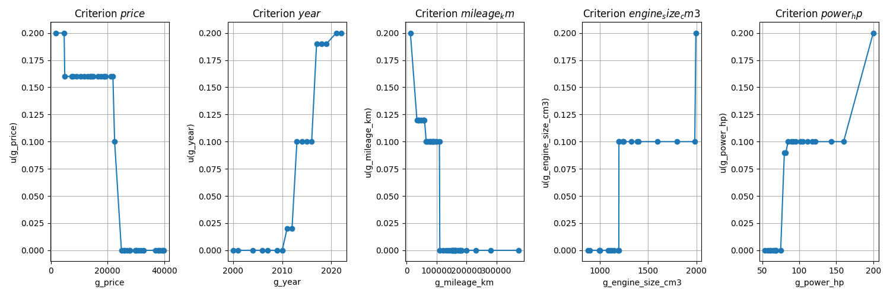

# Multi-Criteria Decision Analysis Report

## Authors
- Mateusz Stawicki 155900
- Mateusz Idziejczak 155842

## Car Selection Problem Analysis

### 1. Dataset Description

We analyzed a set of 10 small city cars available for sale within 100 km of Koziegłowy, with prices under 40,000 PLN. The data comes from [OTOMOTO](https://www.otomoto.pl/), where we scraped listings for cars that might suit a PUT student's needs. We narrowed down from 50 initial listings to 10 representative options to keep our analysis manageable.

Our *totally fictional* buyer is a student living in Koziegłowy, Wielkopolskie - who needs a reliable city car that balances cost, age, mileage, and performance. Since they're a student, practical considerations outweigh aesthetics or comfort - they want the best value for money and maybe a bit of engine power to impress friends.

Specifically, the dataset comprises the first 50 listings from [this exact url](https://www.otomoto.pl/osobowe/seg-mini/kozieglowy_8905?search%5Bdist%5D=100&search%5Bfilter_enum_fuel_type%5D=petrol&search%5Bfilter_float_price%3Ato%5D=40000&search%5Badvanced_search_expanded%5D=true)

Not all available scraped data was used for the MCDA in the end. Still, it is present in the dataset for reference.

#### Full dataset
|title|subtitle|price|currency|year|mileage_km|fuel_type|gearbox|location|seller_type|price_evaluation|url|engine_size_cm3|power_hp|
|---|---|---|---|---|---|---|---|---|---|---|---|---|---|
|Renault Clio 0.9 Energy TCe Limited|898 cm3 - 90 KM - Salon Polska, Pierwszy właściciel, bezwypadkowy i bezkolizyjny|39500|PLN|2017|60098|Benzyna|Manualna|Rawicz (Wielkopolskie)|Prywatny sprzedawca|Powyżej średniej|https://www.otomoto.pl/osobowe/oferta/renault-clio-salon-polska-pierwszy-wlasciciel-bezwypadkowy-i-bezkolizyjny-ID6Hhjbk.html|898|90|
|Dacia Sandero Stepway TCe 90 (S&S) Essential|898 cm3 - 90 KM|39360|PLN|2019|65900|Benzyna|Manualna|Dobrcz (Kujawsko-pomorskie)|Prywatny sprzedawca|W granicach średniej|https://www.otomoto.pl/osobowe/oferta/dacia-sandero-stepway-ID6HhdIw.html|898|90|
...

#### MCDA dataset
|title|price &darr;  (4,700-39,500 PLN)|year &uarr;  (2000-2019)|mileage_km &darr;  (49,459-374,000 km)|engine_size_cm3 &uarr;  (875-1,798 cm³)|power_hp &uarr;  (60-160 HP)|
|---|---|---|---|---|---|
|Renault Clio 0.9 Energy TCe Limited|39500|2017|60098|898|90|
|Renault Megane 1.4 RN 16V|4700|2001|173117|1390|95|
|Dacia Sandero Stepway TCe 90 (S&S) Essential|39360|2019|65900|898|90|
|Mitsubishi Space Star|26000|2017|82000|1193|80|
|Nissan Micra|16500|2011|177491|1198|80|
|Ford KA|19300|2014|139990|1242|69|
|Alfa Romeo Mito 0.9 TwinAir Progression|7800|2009|232000|875|85|
|Fiat 500 1.2 8V Anniversario|13900|2012|93000|1242|69|
|Kia Picanto|36900|2018|56213|998|67|
|Audi A3|22500|2000|374000|1798|160|

## 2. UTA Method Implementation and Results

### 2.1 Implementation Overview

For our car selection problem, we implemented the UTA method to analyze the multiple criteria involved. Our implementation includes:

- Using PuLP with the GLPK solver to formulate and solve the linear programming problem
- Developing a mechanism to handle inconsistent preference information
- Adding constraints to prevent any criterion from having a weight greater than 0.5
- Creating artificial alternatives that vary only on pairs of criteria to ensure balanced weights

### 2.2 Preference Structure

We defined the following preference relations to guide our model:
- Alternative_0 > Alternative_1 (Renault Clio > Renault Megane)
- Alternative_1 > Alternative_2 (Renault Megane > Dacia Sandero)
- Alternative_2 > Alternative_3 (Dacia Sandero > Mitsubishi Space Star)
- Alternative_3 > Alternative_4 (Mitsubishi Space Star > Nissan Micra)
- Alternative_4 > Alternative_5 (Nissan Micra > Ford KA)

We also introduced an inconsistent preference:
- Alternative_2 > Alternative_0 (Dacia Sandero > Renault Clio)

This creates a cycle (Renault Clio > Renault Megane > Dacia Sandero > Renault Clio), which our solver had to find and fix.

### 2.3 Results Analysis

#### Criteria Weights
Our model gave equal weight to all criteria:
- price: 0.2000
- year: 0.2000
- mileage_km: 0.2000
- engine_size_cm3: 0.2000
- power_hp: 0.2000

This happened because of our artificial alternatives that prevent any single criterion from becoming too important. Based on our preference statements, the model couldn't find a reason to make one criterion more important than others.

#### Car Rankings
Top 5 cars according to our model:
1. Peugeot 208 PureTech 75 Allure (0.66)
2. Mitsubishi Space Star 1.2 Clear Tec CVT Active+ (0.56)
3. BMW Seria 1 118i (0.56)
4. Peugeot 208 1.2 PureTech Style (0.48)
5. Peugeot 208 1.2 PureTech Active (0.45)

The scores range from 0.12 to 0.66, giving us a good way to tell the cars apart.

### 2.4 Discussion

1. **Finding Consistent Preferences**: Our solver found and removed the contradictory preference (Dacia Sandero > Renault Clio) to fix the cycle in our preference statements.

2. **Equal Weights for All Criteria**: The artificial alternatives we created helped ensure that no single criterion dominated the decision. This gave us equal weights (0.2) for all five criteria.

3. **Car Utility Patterns**: We found that some cars clearly perform better than others, but many cars have similar overall scores despite having different strengths in individual criteria.

4. **Working Solution**: Our model successfully found a solution after removing the inconsistent preference, showing that our approach was reasonable.

5. **Best Car Option**: The Peugeot 208 PureTech 75 Allure stands out as the clear winner with a utility score of 0.66, which is significantly higher than the other cars.

The UTA method was effective in analyzing this complex car selection problem by handling the preference inconsistency and giving us a clear ranking of all alternatives.